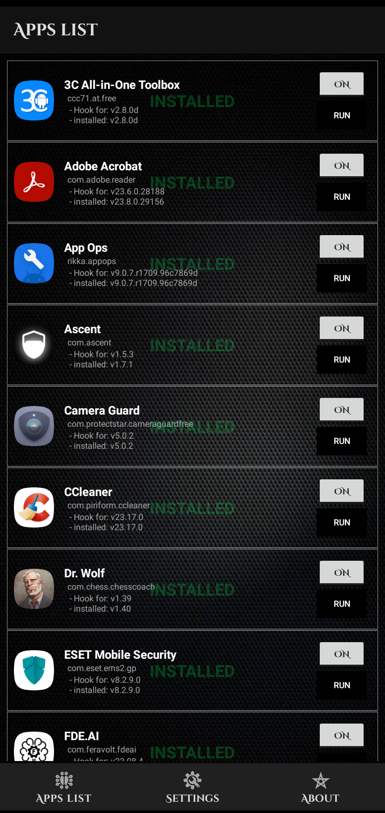

# xCrack-Pro

  

## Description
xCrack Pro for android.
- XPOSED MODULE.

## Screenshots

  
  
  
  

* User interface

## Features
- Enable Premium features for specific apps.
- join telegram channel https://t.me/xCrack_Pro
